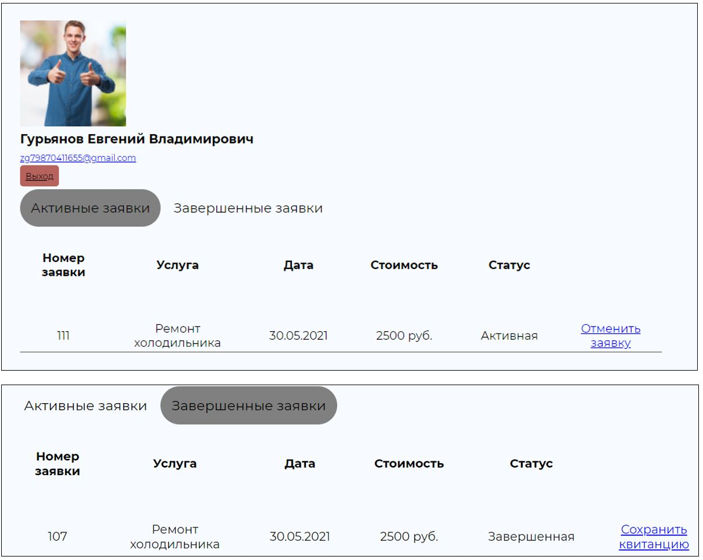

# Мой дипломный проект по разработке веб-приложения для фирмы по ремонту бытовой техники 

#### Приложение работает следующим образом:

1.	Пользователь регистрируется и авторизуется  на сайте формы представлены на рисунках ниже.

2.	После успешной авторизации пользователь может оставить заявку на ремонт, которая затем отобразится у работника и он перезвонит клиенту для уточнения деталей.

3.	У каждого пользователя есть личный кабинет в котором он может следить за статусом своих заявок, отменять их и сохранять квитанция об оплате.

4.	Для работников есть панель администраторя в которой присутствует возможность редактировать перечень услуг, отслеживать заявки и сохранять отчет.

